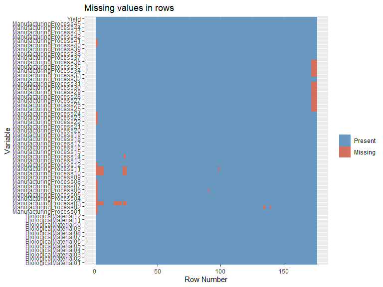
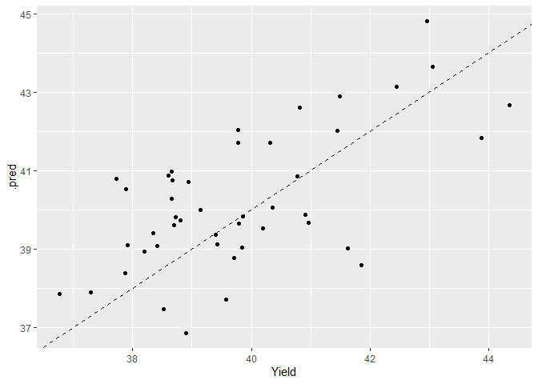

apm\_chemmanproc\_modeling
================
Kevin Cooper
1/12/2021

The purpose of this is to take a look at Max Kuhn’s Applied Predictive
Modeling, particularly at the Chemical Manufacturing Process dataset.
Also a goal of mine has been to learn tidymodeling a little more.

# Data Ingestion

``` r
require(AppliedPredictiveModeling)

#This process is ugly, can fix later.
data(ChemicalManufacturingProcess)
df <- ChemicalManufacturingProcess
rm(ChemicalManufacturingProcess)
```

## Get Libraries

``` r
require(here)
source(here("project_config.R"))
```

# Data Overview & Quality

Incredibly small dataset. It’s either one extreme or another.

``` r
dim(df)
```

    ## [1] 176  58

All variables are numeric. This never happens in the real world.

``` r
sapply(df,class)
```

    ##                  Yield   BiologicalMaterial01   BiologicalMaterial02 
    ##              "numeric"              "numeric"              "numeric" 
    ##   BiologicalMaterial03   BiologicalMaterial04   BiologicalMaterial05 
    ##              "numeric"              "numeric"              "numeric" 
    ##   BiologicalMaterial06   BiologicalMaterial07   BiologicalMaterial08 
    ##              "numeric"              "numeric"              "numeric" 
    ##   BiologicalMaterial09   BiologicalMaterial10   BiologicalMaterial11 
    ##              "numeric"              "numeric"              "numeric" 
    ##   BiologicalMaterial12 ManufacturingProcess01 ManufacturingProcess02 
    ##              "numeric"              "numeric"              "numeric" 
    ## ManufacturingProcess03 ManufacturingProcess04 ManufacturingProcess05 
    ##              "numeric"              "numeric"              "numeric" 
    ## ManufacturingProcess06 ManufacturingProcess07 ManufacturingProcess08 
    ##              "numeric"              "numeric"              "numeric" 
    ## ManufacturingProcess09 ManufacturingProcess10 ManufacturingProcess11 
    ##              "numeric"              "numeric"              "numeric" 
    ## ManufacturingProcess12 ManufacturingProcess13 ManufacturingProcess14 
    ##              "numeric"              "numeric"              "numeric" 
    ## ManufacturingProcess15 ManufacturingProcess16 ManufacturingProcess17 
    ##              "numeric"              "numeric"              "numeric" 
    ## ManufacturingProcess18 ManufacturingProcess19 ManufacturingProcess20 
    ##              "numeric"              "numeric"              "numeric" 
    ## ManufacturingProcess21 ManufacturingProcess22 ManufacturingProcess23 
    ##              "numeric"              "numeric"              "numeric" 
    ## ManufacturingProcess24 ManufacturingProcess25 ManufacturingProcess26 
    ##              "numeric"              "numeric"              "numeric" 
    ## ManufacturingProcess27 ManufacturingProcess28 ManufacturingProcess29 
    ##              "numeric"              "numeric"              "numeric" 
    ## ManufacturingProcess30 ManufacturingProcess31 ManufacturingProcess32 
    ##              "numeric"              "numeric"              "numeric" 
    ## ManufacturingProcess33 ManufacturingProcess34 ManufacturingProcess35 
    ##              "numeric"              "numeric"              "numeric" 
    ## ManufacturingProcess36 ManufacturingProcess37 ManufacturingProcess38 
    ##              "numeric"              "numeric"              "numeric" 
    ## ManufacturingProcess39 ManufacturingProcess40 ManufacturingProcess41 
    ##              "numeric"              "numeric"              "numeric" 
    ## ManufacturingProcess42 ManufacturingProcess43 ManufacturingProcess44 
    ##              "numeric"              "numeric"              "numeric" 
    ## ManufacturingProcess45 
    ##              "numeric"

The names look incredibly unuseful from a process standpoint.

``` r
names(df)
```

    ##  [1] "Yield"                  "BiologicalMaterial01"   "BiologicalMaterial02"  
    ##  [4] "BiologicalMaterial03"   "BiologicalMaterial04"   "BiologicalMaterial05"  
    ##  [7] "BiologicalMaterial06"   "BiologicalMaterial07"   "BiologicalMaterial08"  
    ## [10] "BiologicalMaterial09"   "BiologicalMaterial10"   "BiologicalMaterial11"  
    ## [13] "BiologicalMaterial12"   "ManufacturingProcess01" "ManufacturingProcess02"
    ## [16] "ManufacturingProcess03" "ManufacturingProcess04" "ManufacturingProcess05"
    ## [19] "ManufacturingProcess06" "ManufacturingProcess07" "ManufacturingProcess08"
    ## [22] "ManufacturingProcess09" "ManufacturingProcess10" "ManufacturingProcess11"
    ## [25] "ManufacturingProcess12" "ManufacturingProcess13" "ManufacturingProcess14"
    ## [28] "ManufacturingProcess15" "ManufacturingProcess16" "ManufacturingProcess17"
    ## [31] "ManufacturingProcess18" "ManufacturingProcess19" "ManufacturingProcess20"
    ## [34] "ManufacturingProcess21" "ManufacturingProcess22" "ManufacturingProcess23"
    ## [37] "ManufacturingProcess24" "ManufacturingProcess25" "ManufacturingProcess26"
    ## [40] "ManufacturingProcess27" "ManufacturingProcess28" "ManufacturingProcess29"
    ## [43] "ManufacturingProcess30" "ManufacturingProcess31" "ManufacturingProcess32"
    ## [46] "ManufacturingProcess33" "ManufacturingProcess34" "ManufacturingProcess35"
    ## [49] "ManufacturingProcess36" "ManufacturingProcess37" "ManufacturingProcess38"
    ## [52] "ManufacturingProcess39" "ManufacturingProcess40" "ManufacturingProcess41"
    ## [55] "ManufacturingProcess42" "ManufacturingProcess43" "ManufacturingProcess44"
    ## [58] "ManufacturingProcess45"

Let’s take a look at empties. Steal more code from here:
<https://jenslaufer.com/data/analysis/visualize_missing_values_with_ggplot.html>

This isn’t the prettiest, and not normally what I go after, but achieves
the purpose.

``` r
na_vals <- function(df){
  p <- df %>% 
    mutate(id = row_number()) %>% 
    gather(-id, key = "key", value = "val") %>% #Should update this to pivot_longer later
    mutate(isna = is.na(val)) %>% 
    ggplot(aes(x = key, y = id, fill = isna)) +
    geom_raster(alpha = 0.8) +
    scale_fill_manual(name = "",
                      values = c("steelblue","tomato3"),
                      labels = c("Present","Missing")) +
    #scale_x_discrete(limits = levels) +
    labs(x = "Variable",
         y = "Row Number",
         title = "Missing values in rows") + 
    coord_flip()
  
  return(p)
}
na_vals(df)
```

<!-- -->

``` r
rm(na_vals)
```

Normally there is a timestamp variable. This dataset doesn’t provide
one. I think it will be more ‘fun’ to not assume that there is a time
series elements. So we could assume that these are occasional process
samples taken.

The reason I mention that is because most of the blanks are at the front
and at the end. More often than not, I’ll run a linear interpolation for
all the blanks inbetween and simply remove the first (and last) mostly
blank rows.

For now, let’s focus on modeling and just go after the full rows.
According to this visual, we shouldn’t lose a significant number of
rows. Another fun option is predicting the non-target variables. Maybe
later.

``` r
df <- df %>% filter(complete.cases(.))

df %>% dim()
```

    ## [1] 152  58

Calling that good enough. In the future we can look for outliers, but I
want to move to modeling.

# Modeling

From the previous visual, I can assume the problem is to predict the
yield using the remaining data. I haven’t learned tidy modeling to my
preference, so I plan to walk through the examples in Max Kuhn’s Tidy
Modeling With R: tmwr.org

## Split data

``` r
set.seed(1234)
require(tidymodels)

chemproc_split <- initial_split(df, prop = 0.7)

chemproc_split
```

    ## <Analysis/Assess/Total>
    ## <107/45/152>

``` r
chem_train <- training(chemproc_split)
chem_test <- testing(chemproc_split)
```

## Build the recipe

I’ll start by using all the variables to predict, this is almost never a
good idea.

``` r
simple_chem <- recipe(Yield ~ ., data = chem_train)

simple_chem
```

    ## Data Recipe
    ## 
    ## Inputs:
    ## 
    ##       role #variables
    ##    outcome          1
    ##  predictor         57

## Create models

Start with the basics

``` r
lm_model <- linear_reg() %>% set_engine("lm")

lm_model
```

    ## Linear Regression Model Specification (regression)
    ## 
    ## Computational engine: lm

``` r
lm_wflow <- workflow() %>% 
  add_model(lm_model) %>% 
  add_recipe(simple_chem)

lm_fit <- fit(lm_wflow, chem_train)
```

Can you imagine programming this in PI? This is where too many variables
gets silly

``` r
lm_fit
```

    ## == Workflow [trained] ==========================================================
    ## Preprocessor: Recipe
    ## Model: linear_reg()
    ## 
    ## -- Preprocessor ----------------------------------------------------------------
    ## 0 Recipe Steps
    ## 
    ## -- Model -----------------------------------------------------------------------
    ## 
    ## Call:
    ## stats::lm(formula = ..y ~ ., data = data)
    ## 
    ## Coefficients:
    ##            (Intercept)    BiologicalMaterial01    BiologicalMaterial02  
    ##              1.349e+02               1.798e-01              -2.277e-01  
    ##   BiologicalMaterial03    BiologicalMaterial04    BiologicalMaterial05  
    ##             -1.401e-01               1.037e+00               2.186e-01  
    ##   BiologicalMaterial06    BiologicalMaterial07    BiologicalMaterial08  
    ##              1.776e-01                      NA               7.201e-01  
    ##   BiologicalMaterial09    BiologicalMaterial10    BiologicalMaterial11  
    ##              1.969e+00              -3.346e+00               7.512e-02  
    ##   BiologicalMaterial12  ManufacturingProcess01  ManufacturingProcess02  
    ##             -1.453e+00               1.844e-01              -3.087e-02  
    ## ManufacturingProcess03  ManufacturingProcess04  ManufacturingProcess05  
    ##             -5.173e+00               5.349e-02               1.099e-03  
    ## ManufacturingProcess06  ManufacturingProcess07  ManufacturingProcess08  
    ##              9.130e-02              -2.948e-01               2.237e-01  
    ## ManufacturingProcess09  ManufacturingProcess10  ManufacturingProcess11  
    ##              4.935e-01              -1.435e+00              -1.374e+00  
    ## ManufacturingProcess12  ManufacturingProcess13  ManufacturingProcess14  
    ##              2.304e-04               5.420e-01              -4.588e-02  
    ## ManufacturingProcess15  ManufacturingProcess16  ManufacturingProcess17  
    ##              2.536e-02               5.071e-03              -3.554e-01  
    ## ManufacturingProcess18  ManufacturingProcess19  ManufacturingProcess20  
    ##             -1.541e-03              -1.605e-02              -6.059e-03  
    ## ManufacturingProcess21  ManufacturingProcess22  ManufacturingProcess23  
    ##                     NA              -6.660e-02               3.458e-02  
    ## ManufacturingProcess24  ManufacturingProcess25  ManufacturingProcess26  
    ##             -7.352e-02              -1.519e-02               7.092e-03  
    ## ManufacturingProcess27  ManufacturingProcess28  ManufacturingProcess29  
    ##             -6.682e-03              -9.657e-02               3.097e+00  
    ## ManufacturingProcess30  ManufacturingProcess31  ManufacturingProcess32  
    ##             -3.288e-01               6.028e-02               1.512e-01  
    ## ManufacturingProcess33  ManufacturingProcess34  ManufacturingProcess35  
    ##             -1.029e-01               4.220e+00              -3.256e-02  
    ## ManufacturingProcess36  ManufacturingProcess37  ManufacturingProcess38  
    ##              1.440e+02              -6.951e-01               1.127e-01  
    ## ManufacturingProcess39  ManufacturingProcess40  ManufacturingProcess41  
    ##              2.836e-01               1.279e+00              -2.016e+00  
    ## ManufacturingProcess42  ManufacturingProcess43  ManufacturingProcess44  
    ##             -8.663e-02               2.148e-01              -2.387e+00  
    ## ManufacturingProcess45  
    ##              1.542e+00

## Performance

Not sure I like this process, wasn’t a fan of bind\_cols, understood it
after trying to avoid with mutate (don’t–that will save 15 minutes)

``` r
chem_test_res <- predict(lm_fit, new_data = chem_test %>% select(-Yield)) %>% 
  bind_cols(., chem_test %>% select(Yield))
```

    ## Warning in predict.lm(object = object$fit, newdata = new_data, type =
    ## "response"): prediction from a rank-deficient fit may be misleading

I’ve seen worse models to start with.

``` r
chem_test_res %>% 
  ggplot(aes(x=Yield,y=.pred)) +
  geom_point() +
  geom_abline(lty = 2)
```

<!-- -->

``` r
chem_metrics <- metric_set(rmse, rsq, mae)

chem_metrics(chem_test_res, truth = Yield, estimate = .pred)
```

    ## # A tibble: 3 x 3
    ##   .metric .estimator .estimate
    ##   <chr>   <chr>          <dbl>
    ## 1 rmse    standard       1.52 
    ## 2 rsq     standard       0.400
    ## 3 mae     standard       1.29

That gives us a starting place\! Looking forward to any feedback\!
